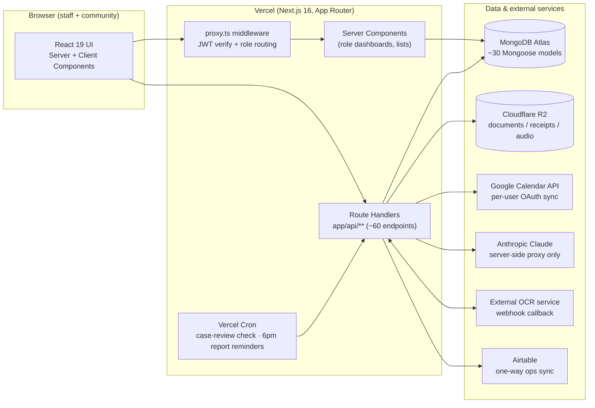
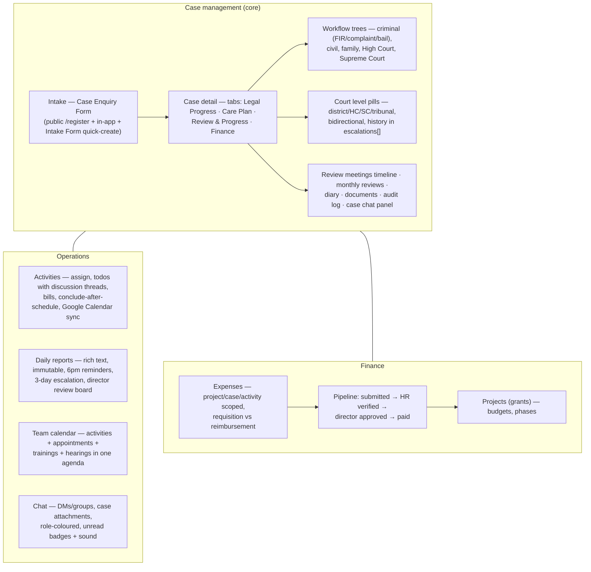
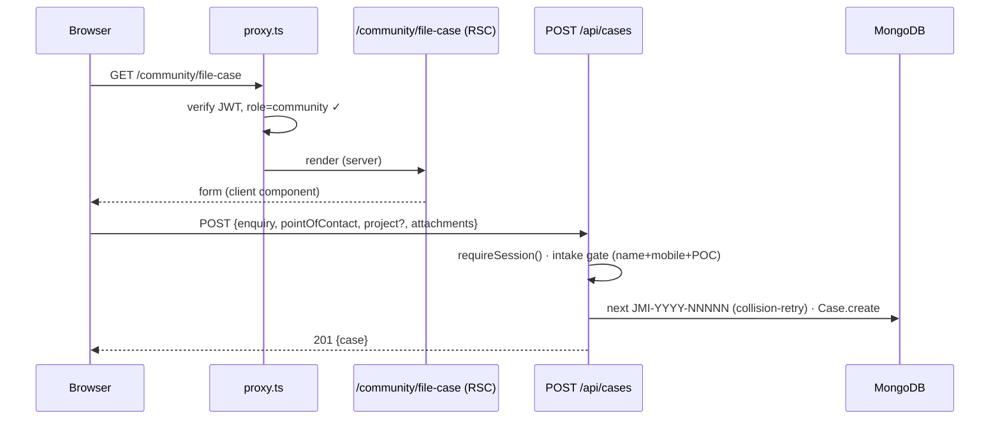
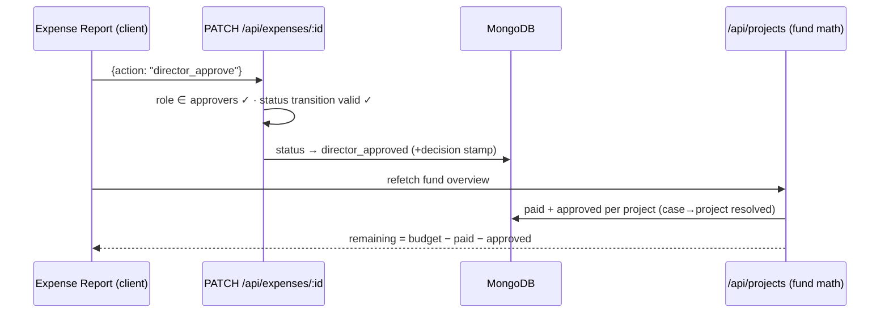

# Janman Legal Aid — System Architecture

> The platform that runs Janman People's Foundation's legal-aid operation: case
> management across India's court hierarchy, staff coordination, community
> intake, and programme finance — one Next.js application, one MongoDB
> database, role-scoped for nine kinds of users.

---

## 1. Bird's-eye view

Everything is **one Next.js app**. There is no separate backend service: server
components read MongoDB directly for first paint; client components mutate
through JSON route handlers under `app/api/**`.

---

## 2. Layers

### 2.1 Routing & access control

| Piece | Role |
|---|---|
| `proxy.ts` (middleware) | Verifies the `auth_token` JWT (jose) on every request, redirects signed-out users to `/login`, and routes each role to its home (`ROLE_HOME`). |
| `components/shared/AppShell.tsx` | Server layout wrapper for authenticated areas: re-reads the session cookie, enforces per-area `allow` role lists, renders `SidebarNav` + `TopBar` + `NotificationBell`. |
| `app/(roles)/<role>/…` | One route group per role — community, socialworker, litigation, hr, finance, administrator, director, superadmin. Each page re-checks the session server-side. |
| Route handlers | Every mutating handler calls `requireSession()` (`lib/auth.ts`) and applies its own role/ownership rules. UI gating is never the only gate. |

**Auth model:** email+password (bcrypt-12) or Google sign-in → signed JWT in an
`httpOnly` `auth_token` cookie (7 days). Users can hold multiple roles and
switch the active one (`/api/auth/switch-role`). `lib/nav.ts` builds each
role's sidebar.

### 2.2 Domain modules

Key domain rules the code enforces:

- **Case creation gate** — no case exists without reporter name, mobile, and a
  point of contact (`POST /api/cases`), except **private cases** (litigation
  creator-only, invisible to everyone else including directors).
- **Workflow follows the court level** — the tree rendered on a case is chosen
  by `courtType` first (supreme → SC tree, highcourt → HC tree), then by
  `flow` (criminal / civil / family). Changing the level never wipes workflow
  data; every change appends to `escalations[]`.
- **Immutable records** — daily reports can't be edited after submission; case
  audit logs are append-only.
- **Money is committed at approval** — a director-approved expense reduces the
  project's remaining budget everywhere, before it is paid. Case bills draw
  from their case's project; unlinked case/activity bills surface in an
  explicit "unallocated" bucket rather than disappearing.
- **Privacy tiers** — staff never see each other's daily reports (only the
  reviewer group: director, superadmin, administrator, HR). Report comments
  have two audiences (everyone vs directors-only). Private cases are visible
  to their creator alone.

### 2.3 Data model (MongoDB via Mongoose)

~30 models in `models/`. The load-bearing ones:

| Group | Models | Notes |
|---|---|---|
| People | `User` | Single collection for all roles; `communityProfile` (verification, enquiry intake, PLV), `litigationProfile`, `socialWorkerProfile` sub-docs; Google OAuth tokens for calendar. |
| Cases | `Case`, `CaseReview`, `CaseReviewMeeting`, `Icp`, `CarePlan` | `Case` is the giant aggregate: enquiry, parties, courtType + escalations, criminalPath / highCourtPath, stageMarks, documents (with OCR status), diary, appearances, comments, audit log, project link, `isPrivate`, `filedDate`. |
| Ops | `Activity`, `TaskAssignment`, `Appointment`, `TrainingSession`, `TrainingMaterial`, `StaffDailyReport`, `DailyReport` (SW weekly form), `EodReport` (invoice flow) | Activity todos embed discussion comments; StaffDailyReport embeds two-tier comments. |
| Money | `Project`, `Expense` | Expense scopes to exactly one of project / case / activity. |
| Comms | `Conversation`, `Message`, `Notification`, `VoiceMessage` | Messages can carry a `caseRef`; notifications drive the bell + reminder flows. |
| Community | `Grievance`, `SosAlert`, `DistrictHelpline`, `LogisticsTicket`, `Asset`, aangan models | |
| Infra | `Translation` (AI i18n cache), `Resource`, `Attendance`, `HeadLawyer` | |

Conventions: denormalised display names (`authorName`, `byRole`) so lists render
without joins; `.lean()` on all read paths; compound indexes on the hot queries
(e.g. `{author, dateKey}` unique on daily reports).

### 2.4 Scheduled & event-driven work

| Trigger | What runs |
|---|---|
| Vercel cron `0 3 * * *` | `POST /api/case-reviews/check` — directors notified when a monthly case review is ≥2 days overdue. |
| Vercel cron `30 12 * * *` (18:00 IST) | `POST /api/staff-reports/check` — "daily report due" nudges + 3-consecutive-day escalations. |
| Opportunistic backstops | The notification-bell poll re-runs both checks (throttled, IST-gated) so reminders work even without cron. |
| Webhook | `POST /api/documents/ocr` — external OCR service calls back with extracted text (shared-secret auth). |
| Best-effort side effects | Google Calendar sync (activities, case hearings, appointments) — never blocks the primary write; idempotency guards prevent duplicate events. |

### 2.5 File storage

`POST /api/upload` → **Cloudflare R2** in production (S3 SDK, zero egress
fees); local `public/uploads` fallback in dev. Stored URLs are attached to
cases (documents), daily-report intake, expense receipts, voice recordings.

---

## 3. Request lifecycles (two examples)

**A community member files a case enquiry**

**A director approves an expense**

---

## 4. Security posture

- JWT in `httpOnly` cookie, `sameSite=strict`, bcrypt-12 password hashes.
- All privileged reads/writes re-checked server-side per handler (role lists +
  ownership); the AI proxy and expense/report lists are explicitly gated.
- The Anthropic API key, Google service credentials, and R2 keys live only in
  server env vars — no external API is ever called from the browser.
- Cron endpoints accept `Authorization: Bearer CRON_SECRET` or a signed-in
  privileged session; the OCR webhook requires its own shared secret.
- Uploads are stored on R2 under generated keys; document URLs are only
  rendered to users who pass the case-access check.
- `npm audit`: 0 known vulnerabilities (postcss pinned via override).

## 5. Known trade-offs / debt

- `path` / `flow` / `courtType` overlap on Case (kept for back-compat; the
  court level is authoritative for tree rendering). A future migration could
  retire `path`.
- `CaseDetailPage.tsx` is a single large client component (heavy tabs are
  code-split; further splitting is possible).
- Notifications are poll-based (15–60s), not push/websocket — acceptable at
  current org size, revisit if headcount grows 10×.
- Legacy structured SW weekly report and the EOD/invoice flow coexist with the
  universal daily report; consolidation is planned.
